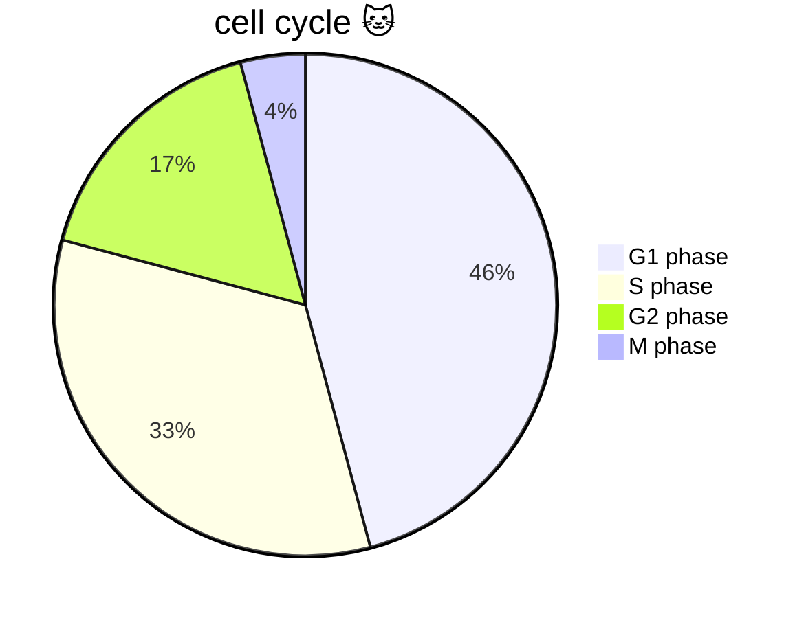
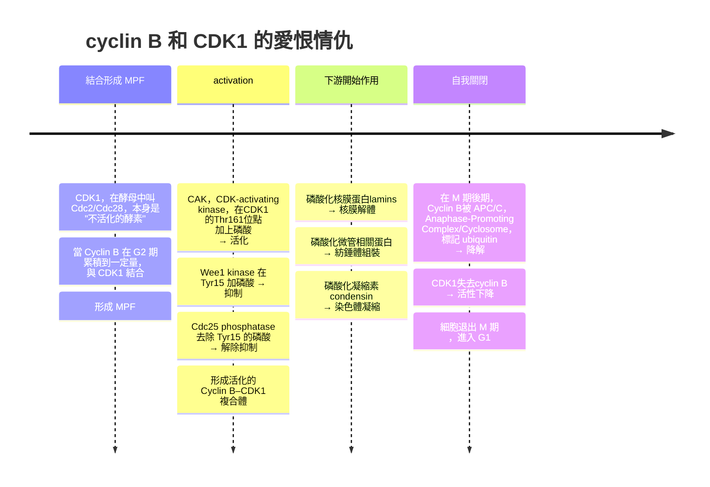
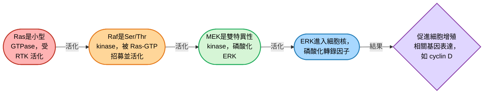
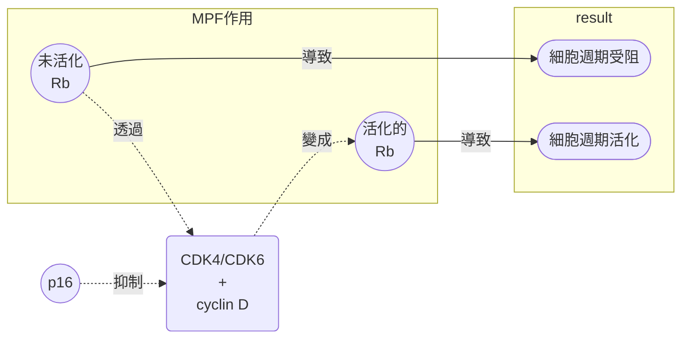
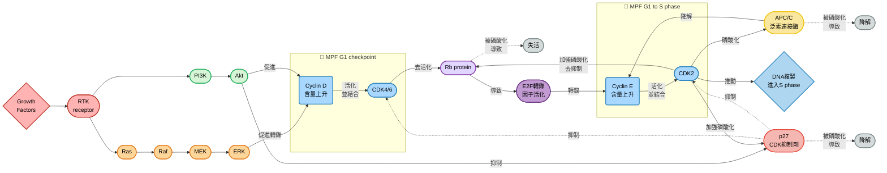

## W12: the cell cycle
### the cell cycle
- 所有細胞都是由細胞分裂生成的，例如，細菌變成菌落需要一個晚上持續的細胞分裂，人類的受精卵需要分裂到約 $10^{14}$ 個細胞
- 細胞分裂跟細胞生長以及DNA複製密切相關

#### 真核生物的分裂週期
- 一共分為四個主要事件: 
  - 細胞生長
  - DNA複製
  - 姊妹染色分體的分配
  - 細胞分裂
- 在真核生物中，細胞週期由一系列的蛋白激酶控制
- 如果這個真核生物屬於多細胞的，更高等的生物 (如mammals)，細胞分裂何時發生，也由細胞外的生長因子 (growth factor) 控制
### phases of the cell cycle
- 可以粗分為兩期: 間期 (interphase) 跟細胞分裂期 (mitosis)
- 如果要稍微細分，可以分成四期: $G_1$ 、 $S$ 、 $G_2$ 、 $M$
##### interphase
- $G_1$ 期的細胞代謝活躍，持續生長，但是不複製DNA
- $S$ 期的時候才是DNA開始複製的時間

> [!Note]
> S = synthesis

- $G_2$ 期是合成蛋白質，為接下來的細胞分裂做準備

##### mitosis
- $M$ 期，染色體分離，並且接續cytokinesis (細胞質分裂)，將細胞一分為二

##### 時間分配
- 如果一個細胞週期是24個小時，那四期時間 $G_1$ : $S$ : $G_2$ : $M$ 分別為11 : 8 : 4 : 1
- 像是酵母之類的東西細胞一周期可能只有90分鐘，更快速

#### 流式細胞儀跟DNA含量測定
- 可以用能夠跟DNA結合的螢光染料標記一群細胞 (by propidium iodide，碘化丙啶)，然後將細胞送到流式細胞儀 (flow cytometry) 裡面，測量單一細胞的螢光強度
- 螢光強度跟DNA含量成正比
- 在分布圖上，可以看到分別對應DNA的含量為2n跟4n，這些就是一個處於 $G_1$ 期，一個處於 $G_2/M$ 期，而兩個峰值之間的區塊，就是處於 $S$ 期的細胞

##### what is 流式細胞儀
- 流式細胞儀對懸浮液中的細胞或微粒進行高速、單細胞、多參數的定量分析與分選
- 細胞懸浮液會在 "鞘液" 的包裹下形成單一細胞流，一個一個通過光束
- 通常利用雷射激發細胞上的螢光染料

    

  - **前向散射光 (FSC)** → 與細胞體積相關
  - **側向散射光 (SSC)** → 與細胞內部結構複雜度相關
  - **螢光檢測器** → 偵測標記的抗原、DNA、RNA 或蛋白質
- 光信號轉換成電脈衝，經電腦分析生成直方圖、點陣圖，進行分群與定量

    

### regulation of the cell cycle
#### 胚胎細胞週期
- 在早期的胚胎細胞周期中，卵細胞質迅速分裂持較小的細胞，此時的細胞不會變大，也不會生長，也就是說沒有 $G_1$ 跟 $G_2$ 期

    

#### 酵母菌的調控方式
##### budding
- 釀酒酵母 (*Saccharomyces cerevisiae*) 的調控主要在 $G_1$ 的**START**點調控，START過程受到營養物質、交配因子 (mating factor)、細胞大小影響
- 一旦細胞通過START，就決定進入 $S$ 期並完成整個細胞分裂，即使之後環境變差也不會回頭
- 這些酵母是透過出芽分裂的，芽在START後便形成並持續生長
- 在 DNA 複製完成 ( $S$ 期) 與染色體分離 ( $M$ 期) 之間，酵母不像哺乳動物細胞那樣有一個長時間的 $G_2$ 準備期
- DNA複製與有絲分裂幾乎緊密相連。細胞在 $S$ 期進行 DNA 複製的同時，已經開始出芽並進行紡錘體組裝

    

##### fission
- 裂殖酵母 (*Schizosaccharomyces pombe*) 透過兩端伸長的方式生長，並且在中間形成細胞壁，進行分裂
- 不同於出芽酵母，DNA 複製完成後，會進入一個長時間的 $G_2$ 期，細胞主要進行生長，增加體積，所以他們有正常的細胞周期
- 其週期主要透過 $G_2$ 到 $M$ 期的轉變來調節

    

| 階段 | 出芽酵母 (S. cerevisiae) | 裂殖酵母 (S. pombe) |
| --- | --- | --- |
| $G_1$ | 有 START 檢查點，決定是否進入 $S$ | 透過 $G_2$ 到 $M$ 期的轉變來調節 |
| $S$ | DNA 複製，同時開始出芽 | DNA 複製，之後進入長 $G_2$ |
| $G_2$ | 幾乎不存在 | 非常長，主要生長期 |
| $M_2$ | 紡錘體組裝、染色體分離、出芽完成 | 紡錘體組裝、染色體分離、細胞分裂 |

#### 生長因素對細胞週期的影響
- 在動物細胞中，生長因子控制動物細胞周期處於 $G_1$ 的限制點 (restriction point)
- 如果在這時沒有生長因子，細胞就會進入 "周期靜止期"，也就是 $G_0$ 期
- 有些細胞在動物體內永久停留在 $G_0$ 期，不再分裂，例如神經細胞。其餘的通常可以回復正常的細胞周期
- 當受到刺激時，會產生一些生長因子或特定細胞外信號，例如，皮膚的fibroblasts通常在 $G_0$ 期，直到受到血小板衍生生長因子 (PDGF) 的刺激活化跟增值

    

#### 檢查點
- 細胞週期期間有多個檢查點，確保基因能完整傳給子細胞
- 通常，在 $G_1$ 、 $S$ 、 $G_2$ 的檢查點如果發現DNA損傷等問題，會使細胞周期停滯，以修復受損或是未複製成功的DNA
- 如果染色體沒有正確的排列在紡錘體上，紡錘體組裝的檢查點也會阻止有絲分裂

    

### regulation of maturation promoting factor
#### 早期實驗
- MPF是細胞週期裡的 "開關分子"，負責推動細胞從 $G_2$ 進入 $M$ 期
- Yoshio Masui在1971[^1]年的研究就發現，利用對卵母細胞進行顯微注射，可以誘導停滯在 $G_2$ 期的細胞進入 $M$ 期
  - 在這個實驗中，他把成熟的蛙卵細胞質注射到未成熟的卵母細胞 (oocyte) 裡
  - 結果這些未成熟卵母細胞立刻進入成熟分裂 (meiotic maturation)，核膜解體、染色體凝縮
  - 這說明成熟卵細胞裡面有一種東西，能促使細胞進入 $M$ 期 !! 😲
  - 這個 "東西" 後來被命名為 MPF (Maturation-Promoting Factor)
- MPF其實並不是卵母細胞特有的，在體細胞中也存在

#### 酵母實驗跟CDC
- Cdc28 = 出芽酵母的主要 CDK (Cyclin-dependent kinase)，它與不同的 cyclin 結合，推動細胞週期各階段
- Paul Nurse在裂殖酵母中鑑定出 cdc2 基因，後來證明它就是 CDK1
  - 溫度敏感突變cdc28-4 (ts mutant): 在低溫下正常，在高溫下失活 → 細胞停在特定週期階段
  - cdc28-null (失活突變): 細胞無法通過 START，停留在 G1，因為沒有 Cdc28 活性去推動 DNA 複製

#### 其餘動物實驗發現
- 後來的實驗從其他生物的胚胎中，找到了一些蛋白質會出現周期性的累積跟降解
- 例如Timothy Hunt在海膽卵中發現了cyclin，cyclin 在細胞週期中**週期性合成與降解**
  - 在interphase累積到一定量 → 啟動 $M$ 期
  - 在 $M$ 期結束 → 被快速降解
- 透過顯微注射cyclin A，就能夠促進青蛙卵母細胞進入 $M$ 期

    

> [!Note]
> 由於發現了細胞週期的關鍵調控因子，Leland H. Hartwell、R. Timothy Hunt和Paul M. Nurse等人得了2001年的諾貝爾獎[^2] 🐱🐱

#### 基本概念
- CDK: 一種酵素，cyclin: 調控蛋白。CDK 必須和 cyclin 結合，才能被活化，推動細胞週期進入下一階段
- 活化的 cyclin–CDK 複合體會磷酸化多種目標蛋白，根據不同的類型，可以啟動 DNA 複製、促進染色體凝縮、核膜解體、紡錘體形成等等
- 例如，cyclin B和CDK1結合，磷酸化後促進細胞分裂的產生，隨後迅速被蛋白酶體降解

##### 深入了解下
- 在酵母菌中: 
  - 跟CDK1反應的 $G_1$ **cyclin (cyclin 1、cyclin 2、cyclin 3)**，共同控制**START**過程
  - 而跟**CDK1**反應的**cyclin B**調控細胞分裂
- 在動物中: 
  - $G_1$ 限制點: 由**CDK4**跟**CDK6**，跟**cyclin D**控制
  - $G_1/S$ 轉換: 由**CDK2**，跟**cyclin E**控制
  - $S$ 期進行 : 由**CDK2**，跟**cyclin A**控制 
  - $G_2/M$ 轉換 : 由**CDK1**，跟**cyclin A**控制
  - M 期進行 : 由**CDK1**，跟**cyclin B**控制

    

#### 抑制調控
- CDK受到抑制蛋白、cyclin和磷酸化的調控

|抑制劑|對應的複合體|作用於何時|
|---|---|---|
|Ink4家族蛋白 (p15, 16, 18, 19)|CDK4跟CDK6| $G_1$ |
|Cip/Kip蛋白家族 (p21, 27, 57) |CDK2/cyclin E複合體| $G_1$ |
||CDK2/cyclin A複合體| $S$ 跟 $G_2$ |

#### complexes of cyclins and cyclin-dependent kinase- G1
- 主要角色就是 CDK4/CDK6 跟 cyclin D，負責幫忙通過 $G_1$ 檢查點
- 生長因子會透過不同的訊息傳遞路徑，例如Ras/Raf/MEK/ERK訊席傳遞路徑 (MAPK cascade) 可以誘導cyclin D的合成，使其可以通過 $G_1$ 檢查點

- 相關的抑制路徑包含Rb跟p16蛋白，它們對周期有抑制作用

- 通常來說，Rb會跟其中一個家族的蛋白E2F結合，該家族負責增加基因的轉錄，Rb相當於抑制了這件事情的發生，使E2F無法動彈
- CDK4/CDK6 + cyclin D會磷酸化Rb，使Rb脫離E2F，使E2F能繼續轉錄細胞週期進行時所需要的蛋白質
> [!Note]
> p16跟Rb屬於腫瘤抑制因子，而Cdk4跟cyclin D1就屬於oncogene 🐱

#### complexes of cyclins and cyclin-dependent kinase- S
- 主要角色就是CDK2 + cyclin E，他負責 $G_1\rightarrow S$ 的轉變
  - 在 $G_1$ 期，CDK2 + cyclin E被p27抑制，當通過限制點之後，由於E2F活化了，誘導 cyclin E 的合成
  - 此外，外界的生長因子傳訊，抑制了p27的合成
  - 一旦CDK2跟cyclin E結合並活化時，p27被CDK2磷酸化，進而被降解
  - 這形成正回饋，進一步活化CDK2 + cyclin E的複合體
  - CDK2 + cyclin E也能抑制APC/C ubiquitin ligase (這酵素原本幫忙降解cyclin E)
- 其中，生長分子信號Ras/Raf/MEK/ERK pathway跟PI3-kinase/Akt，都會降低p27的水平

### 小總結

#### 補充資料在這裡喔 🐱

[^1]:https://onlinelibrary.wiley.com/doi/10.1002/jez.1401770202
[^2]:https://www.nobelprize.org/prizes/medicine/2001/press-release/
