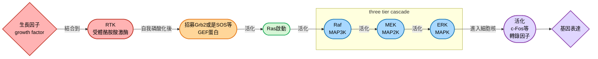
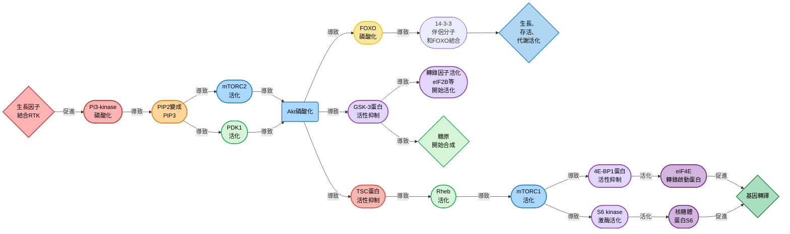
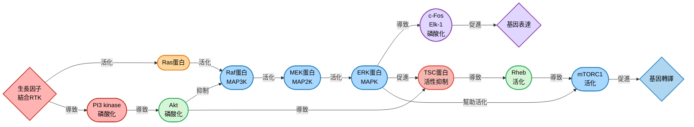

## W11: cell signaling II
學號: 4113052130 科系: 生科2 姓名: 徐詠智
### tyrosine kinase (接續上週)
#### JAK/STAT pathway
- 主要負責把細胞外的細胞激素 (cytokines)、生長因子等訊號，快速轉換成基因表現
- 特色: "直線型" 訊號傳遞

##### 配體結合受體
- 細胞外的cytokine跟生長因子結合到JAK/STAT 受體受體上面，這些受體並沒有酪胺酸激酶活性，但會攜帶JAK (Janus kinase，屬於一種非受體酪胺酸激酶)
- JAK在JAK/STAT受體二聚化之後自我磷酸化 (autophosphorylation)

##### STAT出現
- STAT (signal transducer and activator of transcription) 蛋白屬於轉錄因子，會透過自己的SH2 domain結合到受體上的磷酸化酪氨酸
- 此時JAK將STAT磷酸化，使其活化
- 磷酸化的STAT會倆倆形成二聚體，進入細胞核，啟動或是抑制轉錄目標

    

> [!Note]
> ##### 肌肉為何大量表現Toll樣受體-4 ? 🧐
> - TLR-4本來是 innate immunity 的 receptor，它通常負責辨認細菌LPS、發炎刺激等等
> - 但在胰島素阻抗的人身上，骨骼肌細胞上會大量出現這種受體。研究人員發現，把IL-6 (白介素-6) 長期丟給肌肉細胞，會導致胰島素阻抗的現象增加，及TLR-4 expression增加[^1]
> - 這其實就是因為IL-6會導致STAT3的活化，該轉錄因子負責表現發炎反應的相關基因，包含增加TLR-4表現，也就是 $IL-6\rightarrow JAK\rightarrow STAT3\rightarrow TLR-4\uparrow$ 🐱

#### integrin signal
- 主要和FAK (Focal Adhesion Kinase) 和Src家族激酶，這兩個nonreceptor tirosine kinase有關
- 當負責細胞附著的integrin和ECM結合後，FAK會被招募到膜附近並自我磷酸化
- 同時，FAK活化後招募Src蛋白，放大級聯反應

> [!Tip]
> Integrin–FAK–Src路徑常與RTK路徑整合，讓細胞同時感知 "外部基質" 與 "生長因子" 🐱

#### MAP kinase pathways
- 在真核生物中扮演重要角色
- MAPK (mitogen-activated protein kinase) 的主要酵素，是絲氨酸/蘇胺酸激酶
- 在酵母中，該酵素在配對、細胞形狀、孢子形成上面做為控制的細胞回應。在其他生物中也跟細胞分化以及細胞生長有關係

    

- 通常來說，在three tier cascade的地方，會有所謂的scaffold protein (鷹架蛋白)，固定這三個蛋白質，讓它們之間的respond可以快一點、特異性高一點

##### Ras蛋白調控機制
- GEF透過受體酪胺酸激酶的SH2 domain活化，活化的GEF再去活化Ras
- 平常狀態，Ras綁著GDP，使其處於關閉的狀態
- 鳥嘌呤核甘酸轉換因子 (guanine nucleotide exchange factor，GEF)，會促使Ras釋放GDP，並結合GTP
- Ras-GTP在作用之後會水解GTP，而鳥甘三磷酸水解酶活化蛋白 (GTPase-activating protein，GAP) 會加速Ras把GTP水解成GDP，使Ras重新關閉

##### 級聯反應繼續
- ERK在活化的時候是磷酸化蘇胺酸殘基 (Thr-183) 跟酪胺酸殘基 (Tyr-185)
- ERK最後進入細胞核，磷酸化c-Fos或是Elk-1轉錄因子
- Elk-1會跟SRF等因子一起在SRE區域 (serum response element) 進行轉錄，這造成了立即的、早期的基因表達 (immediate-early gene expression)

    

#### PI3K-AKT pathway
- 同MAPK通路一樣，第一步透過受體酪胺酸激酶的SH2 domain活化，只是這次活化的叫做PI3-kinase
- PI3-kinase接下來磷酸化肌醇 (inositol)，將 $PIP_2$ 變成 $PIP_3$
- Akt、PDK1 跟 mTORC2等蛋白質被招募到 $PIP_3$ 附近並跟其結合，其中，PDK1跟mTORC2會磷酸化跟活化Akt
- Akt繼續活化下游蛋白質，例如直接影響細胞存活、調控轉錄因子、或是其他蛋白激酶，例如Akt的活化會影響GSK-3激酶

> [!Note]
> ##### what is GSK-3
> - 其為一個serine/threonine kinase，它在能量代謝上扮演 "煞車" 角色 (抑制肝糖形成)
> - 其也抑制各種基因表達，以及促進tau protein磷酸化，促進阿茲海默症的病情 🐱

    

##### FOXO 基因的調控
- Forkhead box O (FOXO) 是一群轉錄因子，負責調控: 
  - 抗氧化基因 (如 SOD、catalase)
  - 細胞週期抑制因子 (如 p27)
  - 凋亡相關基因 (如 Bim)
  - 代謝基因 (葡萄糖跟脂質代謝)
- Akt 被活化後，會直接磷酸化 FOXO，這導致FOXO "出核"，它會被14-3-3蛋白抓住，留在細胞質，不能進入細胞核
- 這導致FOXO無法啟動抗氧化、凋亡、抑制細胞週期的基因
> [!Note]
> 由於磷酸化FOXO又是促進增值又是凋亡，所以其跟癌症的惡化也有關係 🐱

##### 下游的 mTOR pathway
- Akt磷酸化後會抑制TSC蛋白，這導致了原本被抑制的Rheb重新恢復活性
- Rheb促進mTORC1的活化
- 相反，AMPK通路相對來說會活化TSC，這導致mTORC1的抑制
- 如果胺基酸不足，一樣會抑制mTORC1
- mTORC1透過磷酸化S6 kinase來促進轉譯
- 其也會磷酸化eIF4E結合蛋白-1 (4E-BP1)，這降低其抑制eIF4E的能力，使其也能去促進轉譯
- mTORC1透過磷酸化Atg蛋白，抑制自噬 
> [!Tip]
> mTORC1決定細胞要不要進入 "合成模式"，如果缺料或停電，mTORC1被抑制，會使細胞合成停工，甚至拆舊樓 (aka自噬)

> [!Note]
> ##### TNF- $\alpha$ 做了什麼?
> - 一般來說，胰島素需要透過胰島素受體底物 (IRS-1) 的酪胺酸殘基磷酸化，它就會活化，促進下游的反應進行
> - 但是，研究發現TNF- $\alpha$ 會透過誘導 IRS-1 的絲胺酸殘基磷酸化，這反而會變成阻斷胰島素受體信號，相當於IRS1轉變為胰島素受體的抑制劑[^2]
> - 這會導致下游的 PI3K-Akt pathway 無法作用，葡萄糖轉運蛋白上不了細胞膜，造成**胰島素阻抗** (insulin resistance，IR)
> - TNF- $\alpha$ 跟IL-6等物質都跟胰島素阻抗，它們都是巨噬細胞等免疫球分泌的cytokine，這樣一來，第二型糖尿病和肥胖本身其實也是慢性炎症性疾病 !! 😲

#### 做個小比較

| 特徵 | mTORC1 | mTORC2 |
| --- | --- | --- |
| **主要功能** | 促進合成、抑制分解 | 調控細胞骨架、存活訊號 |
| **下游分子** | S6K、4E-BP1、ULK1 | Akt (Ser473)、PKC、Rho GTPases |
| **蛋白質合成** |  增加翻譯與核糖體活性 | 間接影響，非主要功能 |
| **脂質/核苷酸合成** | 促進合成，支持細胞生長 | 部分參與膜動態 |
| **自噬** | 抑制自噬（營養充足時） | 幾乎不直接調控 |
| **細胞骨架** | 次要 | ↑ 調控 actin 組織、細胞形態 |
| **細胞存活** | 透過代謝支持 | 直接活化 Akt，增強抗凋亡 |

### receptors couples to transcription factors
- 有些生長因子受體跟轉錄因子有更直接的聯繫，這些轉錄因子在細胞增殖、細胞分化跟存活中起到關鍵作用
- 接下來我們會介紹四大天王 (?) 給各位瞧瞧: 
  - TGF- $\beta$ 通路
  - NF- $\kappa$ B 通路
  - Wnt 通路
  - Notch 信號通路

#### TGF- $\beta$ 通路
- 又稱為 "轉化生長因子 $\beta$ " ，屬於控制多細胞類型增值跟分化的 "多肽生長因子家族"
- 在人的身體中約有30種TGF- $\beta$，對應著七種不同的 I 型受體和五種 II 型受體
- 這些受體可以活化 Smad 蛋白家族的不同成員
- 通常來說，受體就是一個 I 型跟一個 II 型在一起形成二聚體，II 型受體磷酸化後磷酸化 I 型受體， I 型受體活化後再磷酸化 Smad 蛋白
- Smad 蛋白形成複合體後轉入核內活化目標基因轉錄

    

#### NF- $\kappa$ B 通路
- 核因子- $\kappa$ B 由五種轉錄因子組成，在免疫系統跟發炎中起到關鍵作用，也調節多種動物細胞的增殖跟存活
- 在未活化狀態下，NF- $\kappa$ B 的二聚體會在細胞質中跟 $I\kappa B$ 結合
- 當腫瘤壞死因子 (the tumor necrosis factor，TNF) 跟受體結合後 (註: TNF受體由三個多肽鏈組成)，會導致adaptor protein的聚集，使 $I\kappa B$ 激酶磷酸化 $I\kappa B$
- 這一步會導致 $I\kappa B$ 的泛素化，促進 $I\kappa B$ 被蛋白酶體降解
- NF- $\kappa$ B 二聚體轉到細胞核裡面，促進特定基因表達

    

#### Wnt 通路
- 他們促進基因表達的方式，是透過降低下游蛋白的泛素化達成的
- 常常作為無脊椎動物發育學中的角色，也調節成體組織中的幹細胞增殖
- 在沒有Wnt時， $\beta$ -catenin 會被 GSK-3 磷酸化 (這時的GSK-3會跟其他蛋白質，例如Axin、CK1、APC等，組成複合體，咱們稱它為 "破壞四人組")
- 磷酸化的 $\beta$ -catenin會被泛素化，最後透過蛋白酶體被降解，同時，細胞核中的Tcf轉錄因子此時作為基因調控的repressor
- 當Wnt多肽與Frizzled跟LRP受體結合時，dishevelled蛋白會被招募過來，抑制 "破壞四人組" 的活性，這避免了 $\beta$ -catenin 的磷酸化
- $\beta$ -catenin 進入細胞核，跟Tcf轉錄因子結合，使Tcf從repressor變成activator

    

#### Notch 信號通路
- 該通路主要調控動物發育期間的細胞命運
- Notch會跟鄰近細胞上的跨膜蛋白 (如Delta) 進行直接的細胞間訊號傳遞
- 鄰近A細胞的Delta跟B細胞的Notch結合後， $\gamma$ -分泌酵素複合體 (nicastrin + Aph-1 + Pen-2 + presenilin) 會導致Notch釋放自己的一段domain到細胞質中
- 該domain會轉移到細胞核裡面去，跟CSL轉錄因子相互作用，誘導基因表現

    

### 信號網路的樣貌
- 信號通路的活性通常會受到回饋調控控制
- feedback影響了信號的持續時間跟強度

#### 信號動力學
- MAPK的訊號可以導致細胞增殖跟神經元分化，這會取決於ERK產生信號的持續時間
- ERK的瞬間活化可以促進細胞增生，而ERK的持續活化 + 神經生長因子 (NGF) or BEDF 結合，可以使細胞分化成神經元

    

#### 核因子- $\kappa$ B的負回饋調控
- NF- $\kappa$ B 不僅僅是會被 $I\kappa B$ 抑制，這個轉錄因子本身促進表達的基因，也包含 $I\kappa B$ 蛋白的基因 !!
- 所以，NF- $\kappa$ B 表達增加，會導致 $I\kappa B$ 變多，反過來抑制 NF- $\kappa$ B

#### MAPK 跟 PI3K-AKT 的愛恨情仇
- 這兩個東西都有存在正向跟負向的交互作用，這包含但不限於:
  - Ras活化PI3-kinase
  - Akt抑制Raf
  - ERK抑制TSC
  - ERK活化mTORC1 (算了我們還是畫圖好了 🙂)

### 資料來源在這 🐱

[^1]:https://link.springer.com/article/10.1007/s00592-011-0259-z
[^2]:https://www.nature.com/articles/d42859-021-00015-0

