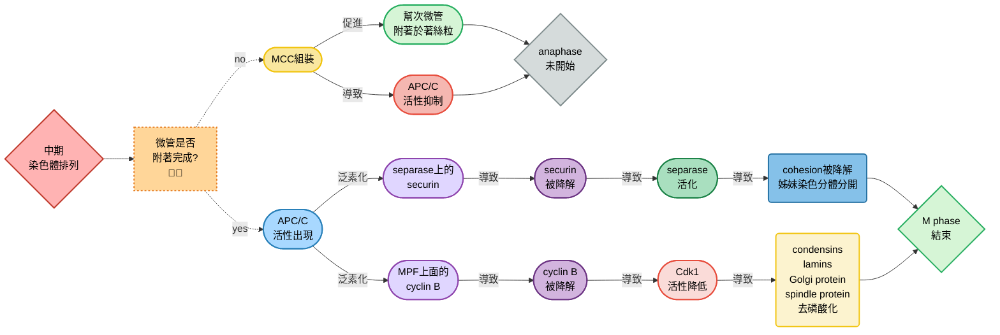

## W13: the cell cycle II
### S phase
#### Cdk2/cyclin E (複習)
- 這兩個主要負責開啟DNA合成， $S$ phase的進行
- 其調控複製起始點什麼時候開始複製DNA，並且確保每次週期裡面，DNA都能完整複製一次，並且只複製一次

##### 複製起始點的準備 (Pre-replicative complex, Pre-RC)
- 在 $G_1$ phase，ORC (Origin Recognition Complex)、Cdc6、Cdt1會幫助把MCM helicase裝載到DNA上，形成Pre-RC
- Pre-RC上有Cdt1、Cdc6、ORC、以及兩個MCM六聚體 (MCM hexamers)

##### Cdk2/Cyclin E 的啟動
- 活化的Cdk2/Cyclin E複合體開始磷酸化目標蛋白
- 它會磷酸化Cdc6、Rb等，讓Pre-RC從 "待命狀態" 變成 "啟動狀態"
  - 其中，DDK會透過磷酸化MCM六聚體的其一單元，讓Cdc45結合到MCM六聚體MCM六聚體的其一單元，上
  - Cdk2/Cyclin E透過磷酸化GINS招募因子，促進GINS結合到MCM六聚體上
  - 接上Cdc45跟GINS的MCM六聚體，會活化整個Pre-RC

##### 複製起始 (Origin firing)
- Pre-RC轉換成 Pre-initiation complex (Pre-IC) 後，開始招募DNA polymerase $\alpha$ /primase，合成RNA-DNA primer，DNA複製開始
- 同時，原本Pre-RC上有的Cdt1、Cdc6、ORC，會因為複製機器的啟動而從原本的Pre-RC上脫落、分解

    

#### 當複製時遇到DNA破壞
##### ataxia-telangiectasia-mutated protein
- 又稱為ATM，負責偵測雙股DNA斷裂
- 當DNA發生斷裂時，ATM會被活化，進而磷酸化Chk2、p53等下游因子
- 啟動 細胞週期停滯、DNA修復，或在損傷過重時誘導apoptosis

> [!Note]
> ATM 基因突變會造成 Ataxia-telangiectasia，病人對輻射極度敏感 🐱

##### ATR Serine/Threonine Kinase
- 又稱為ATR，偵測DNA複製時的壓力，或是單股DNA的存在
- ATR會透過磷酸化的方式活化Chk1，抑制Cdc25 phosphatase
- Cdc25 phosphatase負責Cdk2/Cdk1活化，所以抑制它，會讓細胞停在 $S$ phase或 $G_2/M$ checkpoint，避免帶著錯誤進入分裂
- ATR也協助穩定複製叉，防止DNA崩解

> [!Note]
> - Chk = checkpoint kinase，檢查點激酶
> - Chk1跟Chk2都可以透過磷酸化抑制Cdc25 phosphatase

| DNA 異常類型 | 感測器 | 下游反應 |
| --- | --- | --- |
| Double-strand breaks (斷裂) | ATM | 活化 Chk2, p53 → 停滯/修復/凋亡 |
| Replication stress, ssDNA | ATR | 活化 Chk1 → 阻止進入 $S/G_2/M$ ，穩定複製叉 |

    

#### p53到底是什麼
- 平常的時候，p53會因為MDM2介導的泛素化而被蛋白酶體降解，這使得p53的濃度很低
- 一旦DNA出現異常，ATM跟Chk2會磷酸化p53，被磷酸化的p53會抑制MDM2泛素化自己的可能
- 這個時候p53的濃度會大幅增加，磷酸化的p53二聚化後會促進p21的表達，這導致了Cdk2/cyclin E複合物的抑制，或是Cdk2/cyclin A複合物的抑制，這都會導致細胞週期的停止

> [!Note]
> 癌細胞的基因裡面常常會出現p53的突變，導致其活性或是數量降低，難以進行細胞週期的暫停 🐱

    

### stages of mitosis
- 分為prophase、prometaphase、metaphase、anaphase、telophase、cytokinesis

    

#### in animal cell
- 在prometaphase (前中期) 時，染色體會在兩個中心體之間來回游移，最終會固定在紡錘體中心的赤道板上面，這時細胞進入metaphase (中期)
- 在anaphase (後期) 時，姊妹染色分體分開到細胞兩極的地方
- 有絲分裂在核膜重新形成後正式結束，並且在telophase (末期) 時，染色體解聚
- cytokinesis (細胞質分裂) 時，細胞才正式一分為二
- 這時，每個子細胞都能分到一個中心體，作為下一次細胞分裂的調控者
- 可以用螢光顯微鏡去觀察各個有絲分裂時期的細胞骨架跟染色體構造

    

### entry into mitosis
#### Cdk1/cyclin B
- Cyclin B在G2期累積到一定量，與Cdk1結合，形成 $M$ -phase–Promoting Factor (MPF)
- 其中: 
  - CAK (Cdk-activating kinase) 在Thr161加磷酸 → **活化Cdk1**
  - Wee1 kinase在Tyr15加磷酸 → **抑制Cdk1**
  - Cdc25 phosphatase去除Tyr15的磷酸 → **解除抑制Cdk1**
- 其啟動 $M$ phase的方式包含: 
  - 磷酸化核膜蛋白 (lamins)，導致核膜解體
  - 磷酸化微管相關蛋白，導致微管重組跟組裝紡錘體
  - 磷酸化凝縮素 (condensin) 跟內聚素 (cohesins) ，導致染色體凝集
  - 磷酸化Golgi body周圍的膜蛋白
  - kinetochore跟中心體的磷酸化
- M phase結束後，cyclin B 被APC/C (Anaphase-Promoting Complex) 標記ubiquitin，導致cyclin B的降解
- Cdk1失去cyclin B後，活性下降，細胞退出 $M$ phase，進入 $G_1$ phase

#### 正回饋促進
- Cdk1、Polo-like kinase (Plk1)、以及aurora kinase在 $M$ phase裡面形成了一個「正回饋迴路」，確保分裂一旦開始就能快速、徹底進行

    

- 調控的蛋白質包含: 
  - **Cdk1/cyclin B**: 磷酸化多種蛋白質，同時促進Plk1和aurora kinase的活化
  - **Plk1**: 促進Cdc25 phosphatase活性，進一步強化 Cdk1活性。也參與中心體成熟、紡錘體形成
  - **aurora kinases**: aurora A促進中心體分離、紡錘體組裝；aurora B監控染色體與微管的連結，兩者也能促進Plk1活化

    

#### 染色體凝聚
- 染色體凝集主要由凝縮素 (condensin) 跟內聚素 (cohesins) 負責，它們利用 ATP-dependent環狀結構來控制染色質的 "壓縮" 與 "黏合"

    

##### Cohesins
- 主要在 $S$ phase複製後，把姐妹染色單體黏在一起
- 由SMC1、SMC3、RAD21、SA subunit組成，形成一個一個的 "環" 把兩條DNA鎖住
- anaphase時，separase會切開cohesin，導致姐妹染色單體分離

##### Condensins
- 主要在 $M$ phase時壓縮染色質，讓染色體變粗短
- 主要分為兩個: 
  - SMC2、SMC4和CAP-D2/CAP-G/CAP-H組成，也就是**condensin I**
  - CAP-D3/CAP-G2/CAP-H2組成，也就是**condensin II**
- 利用ATP水解驅動DNA loop extrusion，把染色質 "擠壓" 成更緊密的結構

##### 兩種蛋白的磷酸化跟演變
- 當細胞進入 $M$ phase時: 
  - cohesins由**aurora B跟Plk1**磷酸化
  - condensins由**aurora B跟Cdk1**磷酸化
- 在 $M$ phase時，原本的cohesins會被condensins取代，姊妹染色分體不再像是拉鍊一樣，在核型分析時可以區分兩者
- cohesins此時只有在centromere附近還連著，因為周圍的kinetochore-associated phosphatase會抑制cohesins的磷酸化，避免其脫落

    

#### 核膜的分解
- 核纖層主要由lamins (A, B, C) 構成
- 在 $M$ phase開始時，Cdk1/cyclin B 活化，會直接磷酸化lamins
- 磷酸化後，lamins的二級結構和聚合狀態改變，從聚合纖維解離成單體。這導致核纖層失去支撐力，核膜開始崩解
- 同時，核孔複合體也被磷酸化，核膜片段化 (部分與內質網連續)，染色體因此暴露在細胞質中，方便紡錘體微管接觸

> [!Note]
> - 以前大家認為lamins只是核膜內側的 "鋼筋水泥"，負責支撐nucleus結構
> - 一篇研究[^1]發現，部分lamins於間期在核內部也會被磷酸化，這些 "未聚合 lamins" 可溶，被磷酸化，在核中移
> - 它們能與增強子 (enhancers) 結合，可能直接影響轉錄調控
> - 研究者還認為laminopathy (例如早衰症) 其實也跟這些基因調控方式壞掉有關 🐱

    

#### Golgi body的碎片化
- 有絲分裂的過程中，Golgi body會變成小囊泡，這些囊泡可以被內質網吸收，也可以在細胞質分裂時被分配到子細胞中
- 它是由Cdk1跟Plk1對Golgi body的蛋白質磷酸化達成的

#### 紡錘體形成
- 紡錘體的成熟由位於中心體的aurora A跟Plk1達成
- 紡錘體由三種微管蛋白組成: 動粒微管 (kinetochore microtubules)、極間微管 (interpolar microtubules)、星狀微管 (astral microtubules)，這取決於該微管的位置跟長相，這些微管都是從中心體輻射出去

| 調控因子 | 主要位置 | 功能 |
| --- | --- | --- |
|** aurora A** | 中心體、紡錘體極端 | 中心體分離、微管穩定 |
|**Plk1** | 中心體 | $\gamma$ -tubulin 活化、微管核化 |
| **aurora B** | 動粒 | 監控染色體附著 |

    

- 中心粒在間期時會先複製好，在有絲分裂期的prophase，兩個中心體會移動到細胞兩極
  - 當核膜因為lamins的磷酸化解聚時，染色體暴露，動粒微管會連接到染色體上，他們負責拉動染色體
  - 極間微管會在兩個紡錘體之間彼此交疊，不連接染色體
  - 星狀微管會向外延伸至細胞的周圍
- metaphase時，凝聚後的染色體會排列在紡錘體中心，aka赤道板

##### centrioles (複習)
- 多數中心體由一對中心粒 (centrioles) 相互垂直排列 (perpendicular) 形成，中心體周圍富含pericentriolar material
- 一個中心粒由9*3 + 0的組合形成，也就是九組 "三連微管" 組成，中心粒中間沒有微管

#### spindle assembly checkpoint
- 紡錘體檢查點跟**APC/C泛素連接酶**有關係，該檢查點在通過前，APC/C屬於抑制狀態
- 例如，如果微管沒有好好附著在著絲粒 (也就是動粒) 上面，MCC (mitotic checkpoint complex) 會組裝起來好去修復，這同時也會導致APC/C的抑制

> [!Important]
> ##### centromere vs kinetochore
> - 著絲點是染色體上特定的DNA序列，提供一個 "平台" 讓蛋白質組裝
> - 動粒是在centromere上組裝的多層蛋白結構，連接染色體和紡錘體微管 🐱

- 一旦確定所有染色體都在赤道板上準備好分離，APC/C會被Cdc20活化
  - securin是一個抑制分子，平常跟separase結合
  - APC/C會泛素化securin，導致securin被降解，這會導致separase的活化
  - separase會跑去降解著絲點附近的cohesin，使姊妹染色分體的附著力消失，anaphase開始
- APC/C也會泛素化cyclin B，使原本跟其結合的Cdk1失去活性
- 原本受到Cdk1磷酸化的酵素跟蛋白質開始去磷酸化，有絲分裂期結束

#### anaphase 
##### 染色體分開
- 染色體會沿著動粒微管，往紡錘體兩極移動
- 這個移動的力量來自於微管被kinetochore-associated kinesins解聚，變短 (例如kinesin-13)
- 同時，動粒上也有dynein，會帶著染色體往微管的minus end (也就是中心體端) 移動

##### 紡錘體兩極的分開
- 原本交疊的極間微管會互相推動，這導致兩個中心體越分越開，這個力量是由plus-end-directed動力蛋白執行 (因為他往微管plus end移動)
- 同時，星狀微管也有動力蛋白: minus-end–directed動力蛋白，附著在細胞膜附近，利用星狀微管把中心體往兩側細胞膜拉動

| 動力蛋白 | 移動方向 | 主要位置 | 功能 |
| --- | --- | --- | --- |
| **Dynein** | minus end (往中心體) | 動粒、細胞皮層 | 拉動染色體往兩極移動；協助紡錘體極分離 | 
| **Kinesin-13 (MCAK)** | 非典型 → 去聚合微管 | 動粒附近 | 促進微管去聚合，縮短微管 → 染色體被拉近兩極 | 
| **Plus-end–directed kinesins (如 Kinesin-5, CENP-E)** | plus end (往細胞中間區域) | 紡錘體中間、動粒 | 推動中心體分離、維持雙極紡錘體；幫助染色體沿微管移動 |
| **Minus-end–directed motors (主要是 Dynein)** | minus end (往中心體) | 動粒、皮層 | 拉染色體到中心體；協助紡錘體定位 | 

### cytokinesis
- 由Cdk1的去活化驅動，由於在anaphase時，aurora kinase跟Plk1還維持活性，它們控制的反應促進了核膜的再生成，以及細胞質的分裂

#### in animal
- actin跟myosin II在末期的原本赤道板位置，形成收縮環 (aurora kinase跟Plk1驅動) ，把細胞捏成兩個

#### in plant
- 高等植物不是形成收縮環，而是在原赤道板位置直接生成新的細胞壁跟細胞膜
- Golgi body的囊泡會帶者細胞壁的前驅物，透過極間微管跑到細胞中間，這些囊泡融合在一起，形成一個類盤狀構造，並且跟原本的母細胞的細胞膜融合
- 最終囊泡內的物質逐漸合成細胞壁，兩個子細胞間由plasmodesmata連在一起

    

#### 補充資料在這 🐱

[^1]: https://www.tandfonline.com/doi/full/10.1080/19491034.2020.1832734
