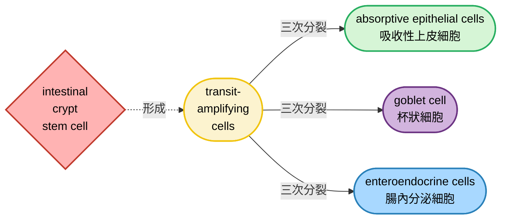
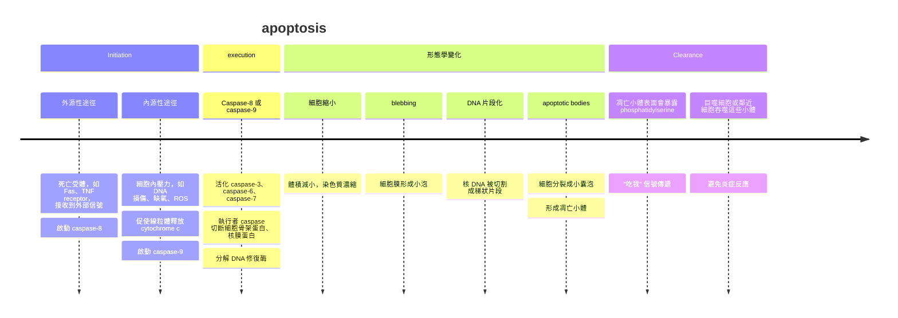
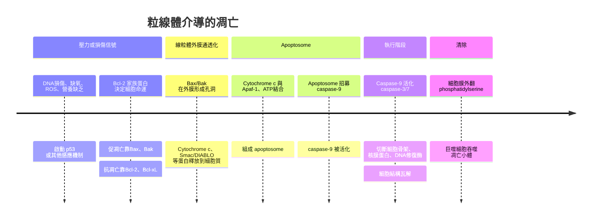

## w14: Cell renewal and cell death
#### before we start the class...

- 一個人的身上的細胞數量需要維持一定的平衡，通常來說，一個人身上共有 $10^{14}$ 個cell，分化成200種有功能的細胞
- **cell proliferation跟cell death互相平衡**

### Cell proliferation
#### 細胞分化後的生長情形
- 已經分化的細胞會進入 $G_0$ phase，但是當需要新的細胞 (例如有細胞死亡或是損傷時) ，會重新進入life cycle
- 這些細胞通常包含fibroblast (纖維母細胞)、endothelial cells (內皮細胞)、smooth muscle cells (平滑肌細胞)、epithelial cell (表皮細胞) 

#### endothelial cell
- 促進其生長的物質叫做grouth factor，尤其是 **"血管內皮生長因子" (VEGF)**
- 如果一些細胞組織需要氧氣，需要新生血管 (例如它們快缺氧死時)，就會產生VEGF，他會促進微血管生長，使組織有氧氣可以使用

    

#### epithelial cell
- 有些內在的上皮細胞也可以增生，以取代受損組織
   - 例如肝臟通常不會再繼續增生，但他會在組織受損時恢復增值
   - 如果說我用手術切掉三分之二的肝臟，剩下的細胞在訊號傳遞下可以在幾天內再生整個肝臟

> ...當然前提是你沒有肝硬化或是脂肪肝 🙂

    

### Stem cells
- 成年體內的大多數細胞幾乎不再具有細胞分裂的能力，而細胞分裂的任務會交給幹細胞來實行
- **stem cell是有自我更新能力的細胞群**，它們不斷複製，並且一部份根據信號分化成特定的細胞
- 壽命較短的細胞背後通常都會有相應的幹細胞幫忙 "填補數量"，這些細胞包含但不限於血球、精細胞、皮膚上皮細胞、消化道內壁細胞
- 當然，骨骼肌跟神經系統也有幹細胞 (雖然他們通常比較不會頻繁替換)
- 基本上stem cell在分裂時，一個會變成stem cell細胞，繼續複製，而另一個細胞進行一系列分化，最後形成特定細胞 (期間可能還會分裂數次)

#### progenitor cells
- **祖細胞通常會分化成 "特定譜系的細胞"**，例如血球會來自血球自己特定的祖細胞
- 祖細胞通常自我更新能力有限 (相對於幹細胞)，被認為是分化途徑的中間體

#### 造血系統 (hematopoiesis)
- 所有的血球細胞 (你能想到的)，基本上都是來自於**造血幹細胞 (hermatopoietic stem cell, HSC)**，造血幹細胞會在骨髓裡面不斷生成血球
- 這些血球還要經過好幾次分裂，逐漸成熟，才會逐漸變成成熟的血球細胞

- 這些細胞的壽命在分化之後往往很有限，有些不到一天，最多數月 (除了記憶性的淋巴球)，但是無論壽命如何，都是來自於同一群HSCs

| 血球種類 | 主要功能 | 平均壽命 | 備註 |
| --- | --- | --- | --- |
| **erythrocytes** | 攜帶氧氣、移除二氧化碳 | 約**120天** | 在脾臟、肝臟分解，鐵與血紅素成分可回收再利用 |
| **platelets** | 止血、凝血 | 約**8–12天** | 短壽命，需要骨髓持續補充 |
| **neutrophils** | 抵抗細菌、真菌感染 | **數小時–數天** | 屬急性免疫反應前線 |
| **eosinophils** | 抵抗寄生蟲、過敏反應 | **數天** | 在過敏或寄生蟲感染時增加 |
| **basophils** | 免疫反應調控 | **數天** | 功能尚未完全釐清 |
| **monocytes** | 吞噬異物、分化為巨噬細胞 | **數天** | 進入組織後壽命延長，成為巨噬細胞 |
| **lymphocytes** | 特異性免疫、記憶反應 | **數月–數十年** | T、B 淋巴球可存活多年，提供長期免疫記憶 |

- 人每天損失的血球量可以到1000億顆，所以骨髓每天都很忙 🫠

#### 腸道的上皮細胞
- 大腸的上皮細胞會在**intestinal crypt (大腸皺褶的底部) 分化**，此處是單層厚的幹細胞
- 這些細胞生長，會在皺褶內壁長出transit-amplifying cells，它們並不是參與吸收水分的細胞，但是占了腸道內壁的2/3

    

- 通常最後他們會分化成以下的細胞: 

- 上層的細胞會不斷進行細胞凋亡，最終混入腸腔裡面

    

#### 皮膚幹細胞
- 毛髮跟皮膚的更新也跟幹細胞有關係
- 皮膚主要由三種細胞組成: **表皮、毛囊、皮脂腺**，這三種細胞都有屬於自己的幹細胞
- 由多層的上皮細胞組成 (**鱗狀上皮**)，表皮的細胞會不斷脫落，並且由**basal layer (基底層)** 生成的細胞所取代
- 這些幹細胞在基底層會經歷三到六次分裂，並漸漸跑到皮膚表面

    

- 皮脂腺的幹細胞，一般來說，會位於皮脂腺上方的基底層中，而毛囊的幹細胞是在皮脂腺的下方的基底層中，形成**特殊的突起 (bulge)**

    

#### muscle
- 肌肉的生成跟其幹細胞-- **satellite cells**有關係

    

#### niche的概念
- 這些幹細胞往往會在特殊濃度的細胞因子畫室環境訊號下生成，這被稱為細胞的 **"微環境" (microenvironments)**
- 這些幹細胞所存在的微環境會維持幹細胞的存活，並控制其更新、複製和分化

#### 訊號感應
- 細胞外信號會啟動分化，例如: 
   - **Wnt signaling**: 控制細胞命運以及軸向的模式形成
   - **BMP (bone morphogenetic protein)**: 促進中胚層以及外胚層的分化
   - **Notch sugnaling**: 影響譜系決定

#### HSC細胞轉植
- 癌症患者通常會進行化療，化療的重點就是抑制那些過度分裂的細胞進行細胞週期，透過藥物使細胞在分裂期間死亡，或是無法複製
- 這對腫瘤很有效，但是同時也會大量殺死病患身上的造血幹細胞
- 因此，這時患者可能會接受**骨髓移殖**，以修復自己的造血功能

> [!Important]
> - 移植時，**移植物抗宿主病 (GVHD)** 是最主要的風險，捐贈者免疫細胞可能會攻擊受者組織
> - 這時可能需要用到免疫抑制劑 (如環孢素、甲氨蝶呤)
> - 這會讓患者免疫力下降，移植後免疫重建非常重要 🐱

    

### Cellular reprogramming
- 雖然成體幹細胞難以分離或是培養，不過分離跟培養**胚胎幹細胞 (ESC)** ，比較容易一些
- 這些細胞基本上可以 "無限培養"，尤其是其具有**pluripotency (多能性)**，可以形成所有我們知道的分化細胞
- 通常來說，需要特定的生長因子（如 LIF 在小鼠 ESC，或 FGF2 在人類 ESC）來防止它們分化，還需要餵養層 (**feeder cells**) 或人工基質來提供支持
- ESC 來源涉及胚胎，如果條件稍有不穩，**ESC 會自發分化，失去幹細胞性質**
- 這些ESC是來自blastocyst中間的細胞群提取出來的，這些細胞一個一個放在培養基上面，會長成一團細胞團 (**embryoid bodies**)，然後進行分化

    

#### 體細胞核移植
- **SCNT, somatic cell nuclear transfer**，複製動物的一種方式，就是透過成年動物的體細胞移植在空核的卵細胞中
- 這種方式產生的複製其實容易失敗，**胚胎存活率極低**，可能只有1%到2%的胚胎可以存活
- 少數動物即使能夠生存，可能也有畸形或是疾病問題，導致壽命通常偏短

> [!Tip]
> 例如Dolly羊就僅活了6年就過世了 🐱

    

#### 治療性複製
- 就是利用體細胞核移植技術來製造胚胎幹細胞的方式，目的是用來**研究或治療疾病**
- 通常會先取出患者的體細胞 (例如皮膚細胞) 的細胞核，將一顆卵母細胞的細胞核移除後，把患者的細胞核移入去核卵母細胞
- 這個 "重組卵" 開始分裂，形成早期胚胎後，在囊胚階段取出胚胎幹細胞，用來培養成患者專屬的細胞或組織
- 由於移植在身上的細胞跟體細胞的基因以及受體基本相同，所以可以**避免免疫排斥問題**
- 不過這種方式通常效率低、容易出現基因或表觀遺傳異常

#### 誘導性多能幹細胞
- 通常跟三個核心轉錄因子有關係: **Oct4、Sox4、Nanog**
- 他們會形成正向的 "自我調節迴路"，活化、維持多能性基因，抑制誘導分化的基因
- 山中伸彌發現透過轉入四種轉錄因子，可以讓小鼠的纖維母細胞重新編程為類似於胚胎幹細胞的形式
- 這也被稱為**iPSC (induced pluripotent stem cells)**，這也讓他獲得2012諾貝爾獎[^1]

    

> [!Tip]
> 這幾個轉錄因子: **Oct4、Sox2、KLF4、c-Myc**，後來也被稱為**Yamanaka factors** 🐱

#### Transdifferentiation
- 有時已經分化的體細胞在一些刺激上也可以變成別的細胞，這又被稱為 "**轉分化**"
- 例如轉錄因子MyoD，在信號夠強的情況下，可以使纖維母細胞分化成肌肉細胞
- 除了肌肉細胞，一個細胞加入不同組合的信號因子，他就會變成不同的東西

### Programmed cell death
- 程序性細胞死亡受到調控，確保細胞命運與生物體的需求一致
- 他對於**維持組織穩態，以及清除有害物質**至關重要
- 在正常人身體中，每天大概有 $5\times 10^{11}$ 個老化的血球細胞凋亡、被清除
- 如果遇到不正常的細胞，身體的**免疫系統也會促進其執行細胞凋亡**，例如NK cells對付癌細胞
- 除此之外，**生物體的發育**也跟凋亡有關，例如兩棲類或是昆蟲在羽化或是成熟時，往往會去除幼體組織
- 人的大腦在發育過程中，也會經歷突觸修剪、多於神經元凋亡、神經元髓鞘化等等過程

- 信號通常來自兩個: 
   - **生長因子**: 這種來自目標細胞的信號會抑制細胞凋亡，甚至是促進分裂
   - **細胞外交互作用**: 和其他細胞，或是跟細胞外基質接觸，可能會促進，或是降低分裂，也可能會促進或是抑制凋亡
- 凋亡通常有以下重要性: 
   - 維持細胞數量的平衡
   - 防止細胞感染擴散、或是防止DNA受損後細胞繼續分裂
   - 調節、修整組織結構

### Apoptosis
- 細胞凋亡屬於主動的、**程序性的細胞死亡**
- 它不像壞死那樣混亂，而是一步一步 "自毀" 來維持組織穩態

- 通常來說，**phosphatidylserine**只會在細胞膜的內側 (inner leaflet)，但是在細胞凋亡的過程中，他會轉向外層 (outer leaflet)
- 巨噬細胞等吞噬細胞會辨認phosphatidylserine，誘導其將該細胞吞噬

    

#### apoptosis in C. elegans
- 在線蟲 *C. elegans* 的研究裡，**ced-3、ced-4、ced-9** 是最早被發現的 "細胞凋亡核心基因"，它們的功能後來被證明和哺乳類的 caspase、Apaf-1、Bcl-2 家族高度同源

##### ced-3
- 編碼一種 **caspase (cysteine protease，半胱天冬酶)**
- 是 "執行者"，直接切斷細胞內蛋白質，引發凋亡
- 相當於哺乳類的 caspase-3

##### ced-4
- 功能類似哺乳類的 **Apaf-1**
- 幫忙活化 ced-3，形成 "凋亡啟動複合體"

##### ced-9
- 抑制凋亡，功能類似哺乳類的 **Bcl-2**
- **ced-9 會阻止 ced-4 活化 ced-3**
- 當 ced-9 功能喪失，細胞就會自發進入凋亡

> [!Note]
> ##### caspase到底是何方神聖
> - **caspase = cysteine-dependent ASPartate-specific proteASEs**
> - 用半胱氨酸殘基作為催化中心，專門切割目標蛋白的 aspartate (天冬氨酸) 位點
> - 可以分成三大類型:
> 
> |啟動型|執行型|發炎型|
> |---|---|---|
> |caspase-8 caspase-9 caspase-10|caspase-3 caspase-6 caspase-7|caspase-1 caspase-4 caspase-5 caspase-11|
> |接收外源性或內源性 線粒體死亡訊號，形成 複合體後自我活化|切斷細胞骨架蛋白 、核膜蛋白、DNA修復酶， 導致細胞結構瓦解|參與inflammasome， 活化 IL-1 $\beta$ 、 IL-18，並引發  pyroptosis|

- 哺乳動物跟果蠅等至少有**7個caspases家族**

#### Bcl-2
- 主要會抑制細胞凋亡，相當於ced-9在做的事情
- 他主要作用是 抑制 cytochrome c 釋放，避免細胞進入凋亡
- 因此，**Bcl-2 確實被歸類為 proto-oncogene**

> [!Tip]
> 最經典的例子是濾泡性淋巴瘤 (**follicular lymphoma**)，因為染色體易位 **t(14;18)** 導致 Bcl-2 過度表達 🐱

- 當然，哺乳動物約有20種Bcl-2相關蛋白
- **這些蛋白有些促進凋亡，有些會抑制凋亡**
- 抗凋亡蛋白 (**antiapoptotic proteins**) 跟促凋亡效應蛋白 (**proapoptotic effector proteins**) 會互相作用
- 通常來說，正常細胞之所以不會自殺，是因為**促凋亡效應蛋白被抗凋亡基因壓著**
- 一旦有信號激活調節蛋白， 促凋亡蛋白 (**proapoptotic regulatory proteins**) 會反手壓制抗凋亡蛋白，使**促凋亡效應蛋白被 "解放" 出來**，導致凋亡發生

    

#### mitochondrial pathway of apoptosis
- 可以分成內源性或是外原性的
   - **Intrinsic Pathway**: 和細胞本身的壓力，例如DNA問題，有關係
   - **Extrinsic Pathway**: 接收到一些配體，要求細胞去死 (?) 

#### Intrinsic Pathway
- 除了**DNA損壞，病毒感染、生長因子不足**，都有可能引發內原性的凋亡
- DNA的損壞會導致**ATM和Chk2蛋白激酶**的活化
- 這會促進**p53**磷酸化，使其不容易被泛素化降解，保持在穩定濃度
- p53也會活化**PUMA、Noxa**等促凋亡基因
- 最終細胞內原性凋亡，或著是在cell cycle被**arrested**而暫停

    

#### 生長因子不足
- 生長因子信號往往跟PI3K/Akt通路有關係
- Akt會磷酸化**Bad等proapoptotic proteins**，這會使它們**失去活性**
- 同時也會使**FOXO轉錄因子**失活，這傢伙原本要轉錄促凋亡蛋白的 🫠
- 其中，**mTOR and GSK-3**負責調控一些抗凋亡的蛋白

#### Extrinsic Pathway
- 這些要求細胞去死的配體有時包含 **"腫瘤壞死因子" (TNF)**
- 這些因子會接在**TNF受體**上面 (該受體也被稱為**Fas**)
- 受體接受到配體後，三聚體化 (trimerization)，透過adaptor招募，活化下游的caspase-8
- caspase-8會直接活化caspase-3跟caspase-7，讓這兩個傢伙瓦解蛋白質
- 他也會間接增加粒線體通透性，使caspase-9被活化

    

### Alternative pathways of programmed cell death
#### Autophagy
- 它和凋亡不同，通常不是直接導致細胞死亡，而是幫助細胞在壓力下生存
- 自噬涉及**自噬小體 (autophagosomes)** 的形成。當細胞缺乏營養、氧氣或受到壓力時，mTOR 抑制，自噬途徑被啟動。隔離膜包裹受損的線粒體、蛋白質聚集或病原體，導致雙層膜的自噬體形成
- 自噬體會與溶體 (lysosome) 融合，形成**自噬溶體 (autolysosome)**
- 溶酶體酶分解內容物，釋放氨基酸、脂肪酸、糖等，將其再利用於能量或合成
- 自噬失調與癌症、神經退化疾病 (如 Parkinson’s) 有關

> [!Important]
> 自噬通常**不涉及caspase的參與 !!** 😲

    

#### Necrosis
- 壞死通常是一種非程序性、失控的細胞死亡，和凋亡、自噬不同。它通常是由外部強烈損傷造成，例如缺血、毒素、外傷或感染
- 特徵往往包含: 
   - **失控性**: 不像凋亡有 caspase cascade 的精密控制，而是細胞直接受損
   - **細胞膨脹以及胞器受損**: 水分進入，細胞膜和胞膜破裂 
   - **內容物外漏**: 細胞膜破裂後，細胞內容物釋放到周圍組織
   - **炎症反應**: 這些外露的物質會觸發DAMPs偵測導致的免疫

    

#### Necroptosis
- 屬於一種**特殊的 "程序性壞死"**，形態上看起來像 necrosis，但其實是由特定分子途徑控制的，所以屬於 programmed cell death 的一種
- 這些信號通常與 TNF- $\alpha$ 、Fas有關係，如果caspase-8 被抑制，導致apoptosis走不通，細胞就會選擇 "程序性炸死" (??? 🫠)
- 其中的核心分子包含**Receptor-interacting protein kinase 、Mixed lineage kinase domain-like protein**等等，具體來說就是: 
   - RIPK1 與 RIPK3 形成 necrosome 複合體，並且活化 MLKL ，這傢伙直接插入細胞膜，導致細胞膜破掉

#### 小比較

| 機制 | 啟動方式 | 分子控制 | 形態特徵 | 是否引發炎症 | 
| --- | --- | --- | --- | --- | 
| **Apoptosis** | DNA 損傷、死亡受體、p53 | Caspase cascade | 細胞縮小、染色質濃縮、膜起泡、形成凋亡小體 | ❎ 不引發炎症 | 
| **Autophagy** | 營養缺乏、mTOR 抑制 | ULK1、Beclin-1、LC3 | 形成自噬體，與溶酶體融合降解 | ❎ 不引發炎症 | 
| **Necrosis** | 外傷、缺血、毒素、感染 | 通常無分子控制 | 細胞腫脹、膜破裂、胞器崩解 | ✅ 強烈炎症 | 
| **Necroptosis** | TNF- $\alpha$ + caspase-8 抑制 | RIPK1、RIPK3、MLKL (necrosome) | 與壞死相似：膜破裂、內容物外漏 | ✅ 引發炎症 | 

---

#### 資料來源 🐱

[^1]: https://www.nobelprize.org/prizes/medicine/2012/summary/
