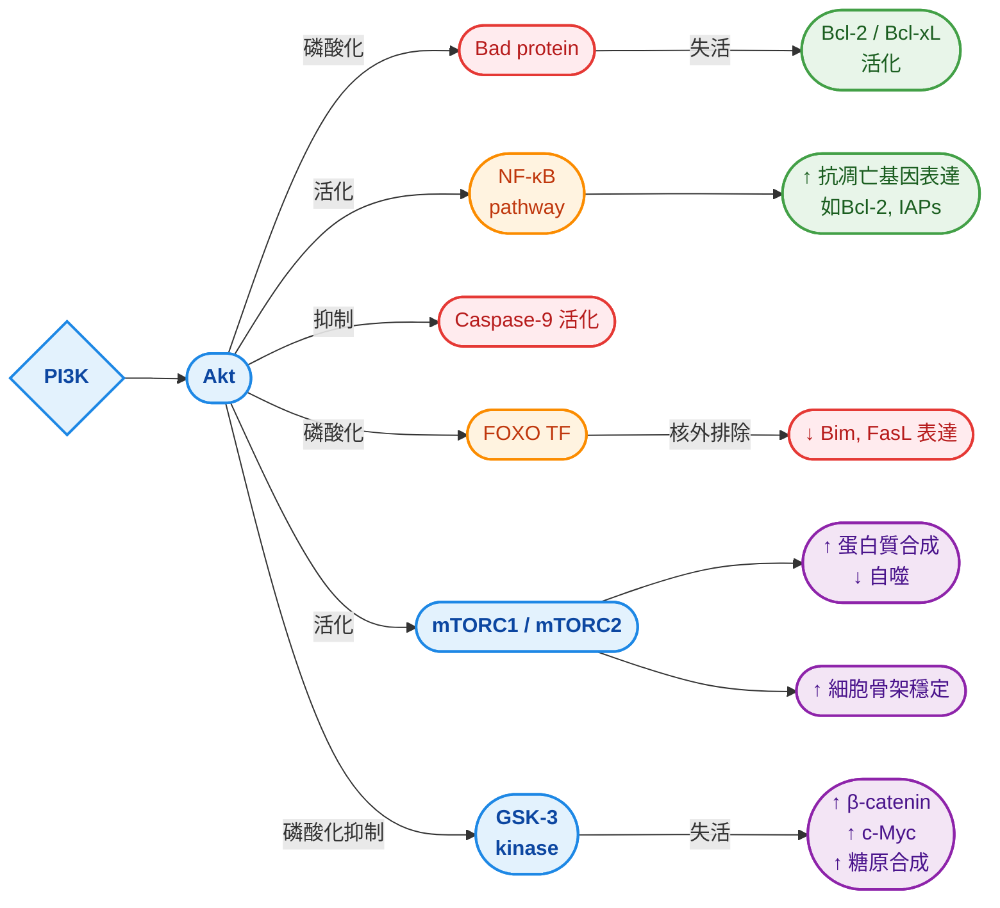
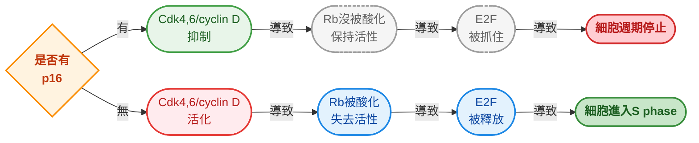
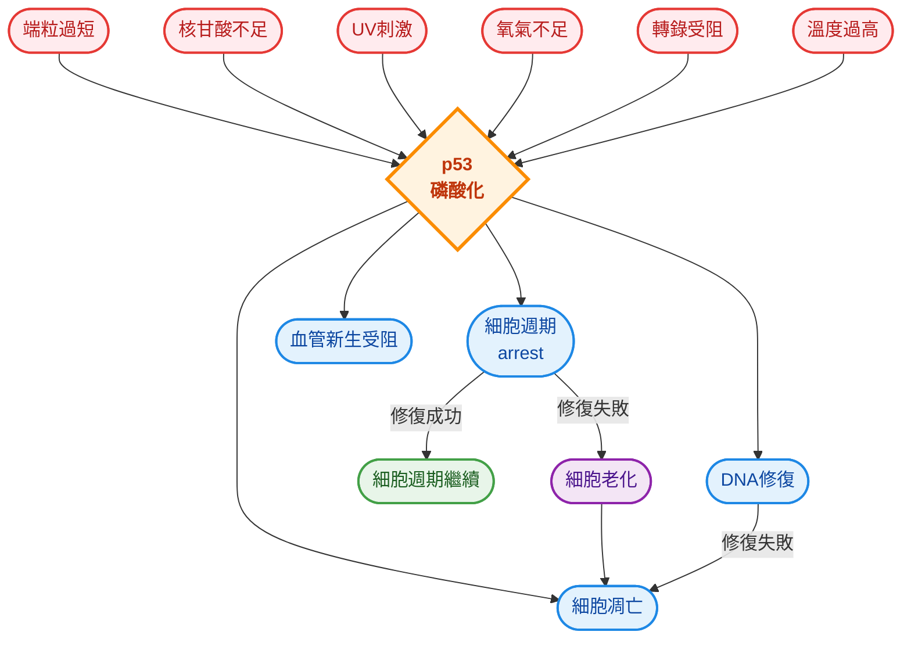
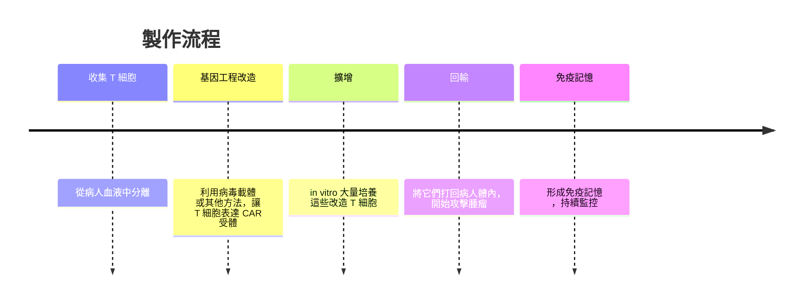

## w15: Cancer cell
### before we start the class...
#### 調控凋亡路徑的訊號通路
- 包含兩種:
  - **pro-apoptosis signal**: 導致細胞凋亡
  - **anti-apoptosis signal**: 維持細胞存活
- 這些路徑可以是內源性 (**Intrinsic Pathway**)，跟細胞的壓力有關係
- 也可以是外源性的 (**Extrinsic Pathway**)，例如凋亡信號

#### intrisic pathway
- 促進因素可以是因為: 
  - **DNA破壞** (例如突變，擔心會導致癌化)
  - **生長因子不足** (細胞分裂有時需要生長因子幫助)
  - **病毒感染**
- p53負責幫忙進行凋亡，DNA 破壞會導致ATM跟Chk2蛋白激酶的活化，這會磷酸化p53，避免其被MDM2降解
- p53活化後會trigger促凋亡蛋白 (如PUMA, Noxa)，這導致了細胞凋亡，或是 cell arrest

> [!Note]
> 尤其是DSB (雙股斷裂) 會導致ATM的活化 🐱

    

#### 生長因子不足
- 這跟細胞外的生長因子，或是細胞跟細胞間的距離、接觸有關係
- **PI3K/Akt pathway** 是細胞存活的關鍵要素
- Akt可以促進促凋亡蛋白 (如Bad) 的磷酸化，這會**導致它們 "失活"**
- 也可以去活化FOXO轉錄因子，導致促凋亡基因無法被好好轉錄
- 除此之外，下游的mTOR 和 GSK-3 pathway可以調節抗凋亡蛋白質

#### 外源性路徑
- 這跟細胞外的的訊號 (例如TNF, FasL等因子)，結合到受體上面有關係 (如TNF receptor,Fas)
- 受體接受到配體後，三聚體化 (trimerization)，透過adaptor招募，活化下游的caspase-8
- caspase-8會直接活化caspase-3跟caspase-7，讓這兩個傢伙瓦解蛋白質
- 他也會間接增加粒線體通透性，使caspase-9被活化

    

#### 免疫系統在其中的作用
- Fas介導的細胞凋亡可以清除癌細胞，或是病毒感染的細胞
- 同時，免疫反應結束後，這些免疫細胞被清除，系統重回平衡

### what is tumor
- 腫瘤起源於正常組織，它們只是相對於正常細胞，收到了不符合它們分化的訊息 (可能是因為開啟的基因有問題，或是基因直接突變，基因組跟一般細胞不同)
- 這些突變的基因可能沒有害，可能會使細胞死亡，也可能使細胞獲得新的、異常的基因並持續生長

#### 腫瘤的種類
- 目前已經命名的腫瘤超過一百種，這些腫瘤的行為不同，針對的治療方法也會有所不同
- 這些腫瘤可以分為: 
   - **Benign tumors** (良性腫瘤): 通常不會侵襲或是擴散 (例如息肉或是疣，warts)
   - **Malignant tumors** (惡性腫瘤): 會對周圍組織有侵襲性，有時還會轉移，擴散時會因為侵襲其他組織而難以完全清除
- 至於癌症 (aka 惡性腫瘤) 也可以根據型態分為下列三大類: 
##### Carcinomas
- 來源通常是**上皮細胞** (epithelial cells)，例如皮膚、腸道黏膜、腺體
- 常形成實體腫塊，容易轉移到淋巴結
- 約佔90%

##### Sarcomas
- 來自於間葉組織 (mesenchymal tissue) 或是結締組織 (connective tissue)，例如骨、肌肉、脂肪、血管
- 相對罕見，常見於年輕人，轉移傾向血液循環
- 通常極少見

##### Leukaemia
- 屬於血液方面的癌症，可能是針對於血球形成的細胞，或是僅針對免疫細胞
- 約佔8%

#### 癌症的擴散 🫠

- 起點通常來自於一個突變的上皮細胞，突破正常的生長控制
- 這些細胞開始在基底膜上方聚集，形成小團塊
- 逐漸形成benign adenoma (小腺瘤)，雖然是異常增生，但仍然**受限於基底膜**，沒有侵入周圍組織

> [!Note]
> 這階段屬於 "良性腫瘤"，但已經是癌前病變的基礎 🧐

- 接下來形成**intermediate adenoma**，腫瘤細胞數量增加，異常細胞比例上升
- 然後腫瘤突破基底膜，進入下方結締組織，這就變成**carcinoma**
- 甚至，癌細胞進入血液或淋巴循環，具備轉移能力

    

#### 失去接觸抑制
##### normal cell 🙂
- 通常來說，正常細胞們當彼此接觸到鄰居時，會停止分裂
- 他們細胞膜上的 cadherins、integrins 等黏附分子會傳遞訊號，啟動抑制性路徑
- 所以正常細胞在培養皿上面形成單層排列，不會無限制堆疊

##### cancer cell 😈
- 癌細胞身上往往 E-cadherin 表達下降或功能喪失，同時PI3K–Akt、Ras、Wnt 等路徑持續活化
- 細胞不理會 "擠滿了" 的訊號，大家疊在一起 (ahhhhh)
- 這導致癌細胞繼續分裂、堆疊，甚至突破基底膜

#### 轉化細胞der四大特徵

|properties|description|
|----------|-----------|
|**型態改變 (morphology alternation)**|在相位差顯微鏡下可以看到形狀有所不同，且展現出折射性|
|**接觸抑制喪失 (loss of contact inhibition)**|細胞可以玩疊疊樂，而且持續不斷生長|
|**非錨定性 (anchorage independent)**|沒有基質接觸依然可以活得很好|
|**長生不老 (immortalization)**|無限增值不會老化|
|**生長因子需求降低(reduce GF requirement)**|不必生長因子的指令就可以進行細胞週期|

#### 為啥會有癌症
- 通常受到多種因素影響，而且是個多步驟過程
- 能引起癌症的物質叫做 "**carcinogens**"

> [!Note]
> 這包含菸、酒、細懸浮微粒，其中吸菸造成了30%的癌症死亡 🐱

#### 癌症跟病毒
- 有些癌症跟病毒感染有關係，主要原因通常可能包含: 病毒基因插入宿主基因組，以及病毒攜帶致癌基因
- 舉例，HPV (人類乳突病毒) 的 E6/E7 蛋白，會抑制 p53 與 Rb，這導致細胞的抑癌基因的失活或是表現降低，容易癌化
- EBV (Epstein-Barr virus) 攜帶 LMP1、EBNA，可以模擬生長因子訊號，促進 B 細胞不斷增殖

| 病毒 | 相關癌症 | 機制 |
| --- | --- | --- |
| **HPV** | 子宮頸癌、口咽癌 | E6/E7 抑制 p53/Rb |
| **HBV/HCV** | 肝癌 | 慢性炎症 and 基因整合 |
| **EBV** | 鼻咽癌、Burkitt 淋巴瘤 | LMP1/EBNA 模擬生長訊號 |
| **HTLV-1** | 成人 T 細胞白血病 | Tax 蛋白導致 NF- $\kappa$ B 活化 |

    

### Oncogenes
#### 勞士肉瘤病毒的發現
- Rous sarcoma virus由美國病理學家 Peyton Rous 在 1911 年發現的
- 他證明了一種 "細胞外濾液" 能在雞隻中引發肉瘤，這是第一次確認病毒能導致癌症

> 讓我們來進入故事... 🫠

- Rous 一天 "有幸" 收到一位農夫送來的 Plymouth Rock 母雞，該雞患有乳房下方肉瘤
- 當時大家認為癌症不會傳染，腫瘤就是細胞自己發瘋。Rous卻很好奇 "如果把腫瘤細胞移植給別的雞呢"
- 結果... 新的雞也長腫瘤了
- Rous把腫瘤組織磨碎，然後過濾，用的是能擋住細胞的濾器。意思是... 細胞被卡住，細菌被卡住，只剩超小的東西通過，然後把濾液打進健康雞體內。結果健康雞也長出同樣腫瘤 🧐
- 這表示... 造成腫瘤的東西比細胞還小 ! 在1910年代，這幾乎等於在說 "病毒可能造成癌症"
- 大家... 🤣🤣🤣 沒人信。Rous因此被無視了50年 😒
- 一直到1966年，距離發現過了55年，Rous終於獲得了諾貝爾生理醫學獎[^1]的肯定。那時他已經87歲了 (oops 😑)

#### RSV到底怎麼讓癌症出現的?
- 1970年代，人們在研究RSV時發現，除了這傢伙是個逆轉錄病毒，該病毒裡有個奇怪基因: **v-src**，它會讓細胞瘋狂分裂
- 大家原本以為這是病毒自己發明了一個致癌基因，結果研究下去發現其實不是，因為雞本來就有這個基因。只是正常雞的基因被稱為c-src，而病毒的為v-src
- 也就是說，病毒只是把雞的基因偷走了，然後改造一下，再塞回去
- 這證明**致癌基因本來就存在於正常細胞裡**，也因此出現了**proto-oncogene**的概念

> [!Tip]
> - c-src = proto-oncogene
> - v-sec = oncogene 🐱

- src其實是tyrosine kinase，它負責傳遞增殖信號，只是v-src讓這個信號變得非常 "頻繁"
- 當病毒偷走 c-src 時，它不是完整複製，偷的過程中發生重組。導致尾巴 (C-terminal tail) 不見了，v-src 缺失了最後一段序列
- 缺失的序列包含**Tyr527**附近的調控區域。沒有 Tyr527，SH2 就抓不到自己的尾巴，導致 "關機" 功能失效

#### other proto-oncogene
- Raf基因突變通常分為兩種: 

##### 病毒亂搞型
- 通常來說，Raf 蛋白質的 N 端有 regulatory domain，負責控制 Raf 的活化
- 而 C 端是 protein kinase domain，能傳遞 MAPK cascade 訊號
- 正常情況下，N 端會抑制 C 端，避免 Raf 隨便亂活化
- 而病毒通常會將該基因進行改造，N端的調節序列變成了病毒自己的一段基因
- 這導致MAPK/ERK pathway 不斷被打開，細胞持續分裂

##### 點突變型
- 人體Raf蛋白家族的一個成員BRAF，有個超級有名的突變: **V600E**，也就是第600個胺基酸的 Valine(V) 變成 Glutamate(E)
- 這個突變讓 BRAF 以為自身一直都處於被活化狀態
- 這個突變在Melanoma、Papillary Thyroid Carcinoma、Colorectal Cancer都能看到
- 其中黑色素瘤最經典，大約一半病例有 BRAF V600E

    

- Ras基因也是一樣也可以透過點突變變成oncogene
- 最常見的突變位點就是codon 12，尤其在 KRAS
- 例如G12D (glycine → aspartate)或是 G12V (glycine → valine)

> [!Tip]
> MAPK通路在大部分癌症中常常都是主角，包含我們剛剛提到的ras (例如K-ras) 或是raf (B-raf)，都是屬於這個通路的一部分 🐱

### 染色體易位
- 染色體易位時，會導致基因表現異常，或是產生出錯誤蛋白
- 最有名的就是費城染色體 (Philadelphia chromosome)，會導致chronic myeloid leukemia (CML)
- 通常來說，無論是易位還是缺失還是插入，都可以利用 "chromosome painting"，標記各個染色體
- 此技術利用的方式是FISH (fluorescent *in situ* hybridization)，讓每一條染色體顏色都不一樣

    

#### chronic myeloid leukemia
- 染色體易位 t(9;22)(q34;q11)，第 9 號染色體上的 ABL1 基因 (酪氨酸激酶) and 第 22 號染色體上的 BCR 基因
- 它們兩者融合，形成 BCR-ABL 融合基因
- 這種混合基因持續活化的酪氨酸激酶，不需要正常的調控訊號就能驅動細胞增殖，促進粒線體代謝、DNA 合成、抗凋亡
- 這導致骨髓造血幹細胞不斷分裂，骨髓產生大量顆粒性白血球，血液中出現未成熟的粒細胞
- 隨時間可能進展到急性期 (blast crisis)，類似急性白血病

    

#### 基因擴增是什麼
- 某些基因在染色體上被大量複製，有時會導致對應的蛋白質表達量大幅上升，導致細胞持續接收生長或存活訊號
- **Amplicon** 指的是在染色體上 被重複擴增的一段 DNA 區域，這段區域通常包含 oncogenes 或其他能促進腫瘤生長的基因
- 當這些基因被擴增成多份拷貝時，對應的蛋白質表達量就會大幅增加
   - 可以是染色體上的串聯重複 (tandem repeats)
   - 也可能形成雙微染色體 (double minutes)，即小型的額外染色體片段
- 除此之外，他也可以形成染色體缺失，屬於一種動態結構
- 癌細胞基因組裡面就有很多種不同基因的擴增，這些擴增對細胞的生長來說有利

### Tumor suppressor genes
- 通常會抑制細胞增生或存活，進而抑制腫瘤發展。這些基因有些甚至直接跟致癌基因的通路拮抗
- 在許多癌症中，腫瘤抑制基因常常缺失或是失活，導致其增長不受控
- 目前發現跟癌症有關的抑癌基因超過50種

#### 細胞融合
- 大多數情況下，如果將正常的細胞跟腫瘤細胞做融合，可以發現這種細胞並不會變成腫瘤
- 猜測是因為正常細胞的基因作用，導致腫瘤無法形成

#### Rb and HPV
- Rb 指的是retinoblastoma protein，由RB1編碼。它是經典的 tumor suppressor gene
- 名稱來源是因為該基因的突變往往會導致家族性的遺傳癌症: 視網膜母細胞瘤 (retinoblastoma)，所以該基因又被稱為Rb
- RB1 必須兩個等位基因都失效，細胞才會失去控制
- 如果一份 RB1 基因突變 (可能是遺傳或後天)，另一份 RB1 基因因 LOH 而喪失，兩份 RB1 都失效
- 這被稱為 "兩擊假說"

- Rb 會抓住 E2F，使其處於關閉狀態，當細胞收到生長訊號，CDK4/6 會去磷酸化 Rb。Rb 被磷酸化後就會失活，放開 E2F，使細胞進入 $S$ phase
- HPV在進入細胞時，有些細胞根本沒有進行細胞週期，因此高風險 HPV 會表現 E7 蛋白
- E7 除了會直接結合 Rb，還會促進 Rb 降解。這導致 E2F 大量作用，細胞被強迫進入 $S$ phase

    

#### 複習: Rb和P16

#### p53 and cancer
- 很多的癌症也和p53有密切關係，這些癌細胞的p53常常呈現失活狀態[^2]

    

- 他負責控制細胞週期的停滯以及細胞凋亡，約在50%的癌症之中都佔有一席之地，也因此成為大街的標靶藥物

#### dominant-negative allele
- p53如果需要作用，那麼就需要其結合成四聚體，但是如果但凡任何一個單體出現問題，這個四聚體蛋白質的活性就會大幅降低，甚至消失
- 假如說你是異型合子，一個p53基因正常，另一個突變，那你的身體中，出現缺陷的p53四聚體蛋白比例大概就是: 

$$1-\frac{1}{2^4}=\frac{15}{16}$$

- p53的作用時機，總結來說如下: 

- 很多癌症其實基本上都有超過一種以上的基因突變，這些突變會導致癌症發生或是擴散
- 隨著時間推移，不同時期的癌症，其未來存活率也不同。通常越後期的癌症存活率越低

    

### Immunotherapy
#### monoclonal antibodies
- 單株抗體是由單一 B 細胞克隆所製造的 "完全相同" 抗體，能專一性地辨認並結合某一抗原的特定表位
- 它們在癌症治療、免疫疾病、感染控制等領域都有重要應用
- 所有抗體分子完全相同，對同一抗原表位具有單一專一性，針對於單一表位，純度高 (和polyclonal antibodies不一樣)
- 當抗體附著於癌細胞時，免疫細胞可以辨識於這些抗體，並針對該細胞攻擊 (例如說胞毒性免疫)，導致細胞凋亡

    

> [!Note]
> 這些抗體通常來自於小鼠，但是完全來自小鼠的抗體容易引起免疫反應，因此可能會使用部分小鼠 + 人類序列的抗體 (chimeric antibodies) 來降低排斥 🐱

#### CAR-T
- CAR-T 是一種免疫療法，把病人自己的 T 細胞抽出來，經過基因工程改造，讓它們表達一個嵌合抗原受體 (chimeric antigen receptor, CAR)
- 這個 CAR 能直接辨認腫瘤細胞表面的抗原，而且不需要 MHC 的呈現 !!
- 改造後的 T 細胞再回輸到病人體內，成為 "定製化的抗癌軍隊" 😏

| 優點 | 缺點 |
| --- | --- |
| 高度專一性，能精準殺死腫瘤細胞 | 嚴重副作用 (細胞激素釋放症候群, CRS) |
| 可持續存在於體內，形成免疫記憶 | 腫瘤抗原異質性，可能逃逸 |
| 對血液腫瘤療效顯著 | 製作成本高，流程複雜 |

    

### 資料來源 🐱

[^1]: https://www.nobelprize.org/prizes/medicine/1966/
[^2]: https://pmc.ncbi.nlm.nih.gov/articles/PMC2827900/
